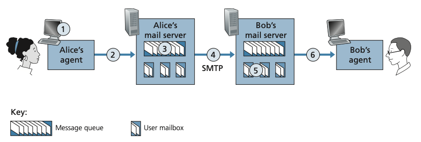

# 2.3 Electronic Mail in the Internet
### 2.3.1 SMTP
SMTP(Simple Mail Transfer Protocol)는 발신 메일 서버에서 수신 메일 서버로 메시지를 전송하는 애플리케이션 계층 프로토콜로, [RFC 5321](https://berom.tistory.com/301)에 정의되어 있음.

#### **특징**
- **TCP 포트 25**를 사용하며, 신뢰성 있는 데이터 전송 보장.
- **클라이언트/서버 모델**:
  - 발신 메일 서버는 SMTP 클라이언트로 동작.
  - 수신 메일 서버는 SMTP 서버로 동작.
- **직접 연결**: 중간 서버를 거치지 않고 발신 서버에서 수신 서버로 직접 TCP 연결.

#### **전송 과정**
1. **발신자가 메시지 작성**  
   - Alice가 Bob에게 메시지를 보내기 위해 사용자의 이메일 클라이언트를 사용해 메시지를 작성하고 발신.
2. **발신 메일 서버에 저장**  
   - 메시지는 Alice의 메일 서버의 대기열에 저장됨.
3. **TCP 연결 설정**  
   - Alice의 메일 서버(SMTP 클라이언트)가 Bob의 메일 서버(SMTP 서버)와 TCP 연결을 생성.
4. **핸드셰이킹**  
   - SMTP 클라이언트와 서버가 서로 소개하며 연결을 설정.
   - 명령 예시: `HELO`, `MAIL FROM`, `RCPT TO`, `DATA`, `QUIT`.
5. **메시지 전송**  
   - 클라이언트가 메시지를 서버에 전송.
   - 데이터 종료는 단독 `.` 줄로 표시 (`CRLF.CRLF`).
6. **연결 종료**  
   - 모든 메시지를 전송한 후, `QUIT` 명령으로 연결 종료.

##### **예시**
S: 220 hamburger.edu  
C: HELO crepes.fr  
S: 250 Hello crepes.fr, pleased to meet you  
C: MAIL FROM: <alice@crepes.fr>  
S: 250 alice@crepes.fr ... Sender ok  
C: RCPT TO: <bob@hamburger.edu>  
S: 250 bob@hamburger.edu ... Recipient ok  
C: DATA  
S: 354 Enter mail, end with ”.” on a line by itself  
C: Do you like ketchup?  
C: How about pickles?  
C: .  
S: 250 Message accepted for delivery  
C: QUIT  
S: 221 hamburger.edu closing connection

#### **한계**
- 메시지 본문과 헤더를 **7비트 ASCII**로 제한.
  - 멀티미디어 데이터는 ASCII로 인코딩/디코딩 필요.
- HTTP와 달리 멀티미디어 데이터를 원본 그대로 전송하지 못함.

---

### 2.3.2 메일 메시지 형식
전자 메일은 **헤더(Header)**와 **본문(Body)**으로 구성되며, 두 부분은 빈 줄([CRLF](https://brunch.co.kr/@hongjyoun/97))로 구분됩니다.

#### **헤더 구성**
- 헤더는 메시지의 부가적인 정보를 포함하며, RFC 5322에 정의됩니다.
- 각 헤더는 **키워드: 값** 형식으로 작성됩니다.

##### **필수 헤더**:
- `From:` 발신자 주소.
- `To:` 수신자 주소.

##### **선택적 헤더**:
- `Subject:` 메시지 제목.

#### **예시**
From: alice@crepes.fr  
To: bob@hamburger.edu  
Subject: Searching for the meaning of life.

#### **본문**
- 헤더 이후 작성되며, 보통 ASCII 텍스트로 구성됩니다.

#### **Telnet을 활용한 테스트**
1. `telnet serverName 25` 명령으로 메일 서버와 TCP 연결.
2. SMTP 명령을 순차적으로 입력:
   - `HELO`, `MAIL FROM`, `RCPT TO`, `DATA`, 메시지 본문, `CRLF.CRLF`, `QUIT`.

---

### 2.3.3 메일 액세스 프로토콜
SMTP는 발신에서 수신 메일 서버로 메시지를 푸시(push)하지만, 수신자가 메시지를 가져오는 데는 적합하지 않습니다. 이를 해결하기 위해 **IMAP**과 **HTTP**를 사용합니다.

#### **IMAP (Internet Mail Access Protocol)**
- RFC 3501에 정의된 프로토콜.
- 수신자가 메일을 서버에서 가져오고 관리할 수 있음.
- **주요 기능**:
  - 폴더 정리, 메시지 삭제, 중요 표시 등의 작업 가능.

#### **HTTP**
- Gmail과 같은 웹 기반 이메일 또는 스마트폰 앱에서 사용.
- 메일 서버는 HTTP 인터페이스를 제공하여 사용자가 메일을 검색(pull)할 수 있도록 지원.

#### **전송 과정**
1. Alice의 사용자 에이전트가 SMTP 또는 HTTP를 통해 Alice의 메일 서버에 메시지를 전송.
2. Alice의 메일 서버가 SMTP를 통해 Bob의 메일 서버로 메시지를 전송.
3. Bob의 사용자 에이전트가 HTTP 또는 IMAP을 통해 메시지를 검색.

#### **특징 비교**
기능               | SMTP                                    | IMAP/HTTP                          
-------------------|-----------------------------------------|------------------------------------
역할               | 메일을 발신 서버에서 수신 서버로 전송   | 수신자가 메일 서버에서 메일을 가져옴    
작업 방식          | 푸시(Push)                              | 풀(Pull)                           
연결 상태          | 메시지 전송 후 연결 종료                | 서버 상태와 동기화 유지             
관리 기능          | 없음                                    | 폴더 정리, 읽음/안읽음, 삭제 등 관리 가능
